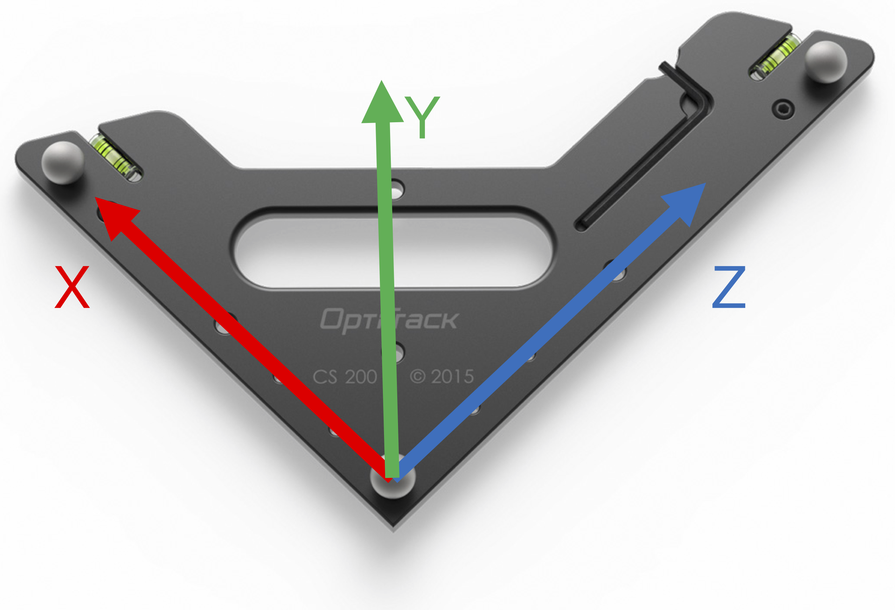
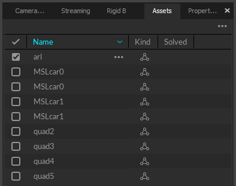

## Preliminary
* Turn on the `mocap` computer and the power strip in the flight room to power the cameras and router for the local network. 
* Open Motive on the `mocap` computer
* Select the layout entitled `FlightRoomLayout` in the upper-right corner of Motive to display the standard window configuration

## Calibration
Calibrating the Optitrack system refers to the process of identifying the intrinsic and extrinsic parameters of each camera in the network. This process requires maneuvering the calibration wand around the environment to collect multiple images of the wand from each camera. Motive performs an optimization on this data to estimate the parameters. After this step, other objects in the space may be triangulated from the known camera poses. 

Calibration should only be completed if there is significant tracking error or your experiment requires extreme precision. Refer to the video below to calibrate the system. 

<iframe width="560" height="315" src="https://www.youtube.com/embed/cNZaFEghTBU" frameborder="0" allow="autoplay; encrypted-media" allowfullscreen></iframe>

## Coordinate Frames in Optitrack
The world coordinate frame in Optitrack is determined by setting the ground plane in the calibration. By default, this coordinate system is defined as in the image below. 

## Setup Rigid Bodies
Rigid bodies are defined by a set of retro-reflective markers attached to the objects in the flight room. These markers are available to everyone on the flight room's desk. Refer to the video below to define rigid bodies
<iframe width="560" height="315" src="https://www.youtube.com/embed/Z9kO7jJgCLE" frameborder="0" allow="autoplay; encrypted-media" allowfullscreen></iframe>

Rigid bodies are labeled by their `asset` name. This information can be accessed through the `asset` pane as shown below. 

## [Optional] Configuring User Mouse Preferences
* Edit ­> Mouse Controls
* Select User Profile ­> Motive
* [x control i.e. rotate] ­> Mouse Buttons ­> Left/Right/Middle
* Assign