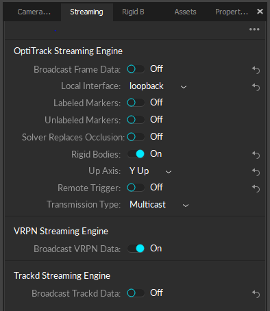

The easiest way to read motion capture data is with the [Virtual Reality Peripheral Network (VRPN)](http://vrpn.github.io/). VRPN is already integrated with Motive and can also be used with ROS. Additionally, Natural Point offers a SDK for Motive if you prefer to interface with Optitrack without ROS. 

## Preliminary
Refer to [Connecting to the Local Network](/start_network), [Motive Software](/motion_capture_motive), and [Using ROS](/start_ros)

## Start the VRPN Server in Motive
In Motive, under the `Data Streaming` pane, ensure the settings correspond to the ones shown below. 



The default pose that is published by VRPN is in the Y-up configuration. If desired, this can be changed to a Z-up configuration. 

## Start the VRPN Client in ROS
On your ROS-enabled machine, install the ROS package [vrpn_client_ros](http://wiki.ros.org/vrpn_client_ros). This package ships with a launch file `sample.launch` that must be modified by changing line 3 from
```bash
<arg name="server" default="localhost"/>
```
to 
```bash
<arg name="server" default="mocap.local"/>
```
Launching `sample.launch` will publish a `geometry_msgs/PoseStamped` message on the topic `vrpn/[asset_name]/pose`, where `[asset_name]` is the name of your asset (rigid body) in Motive. 