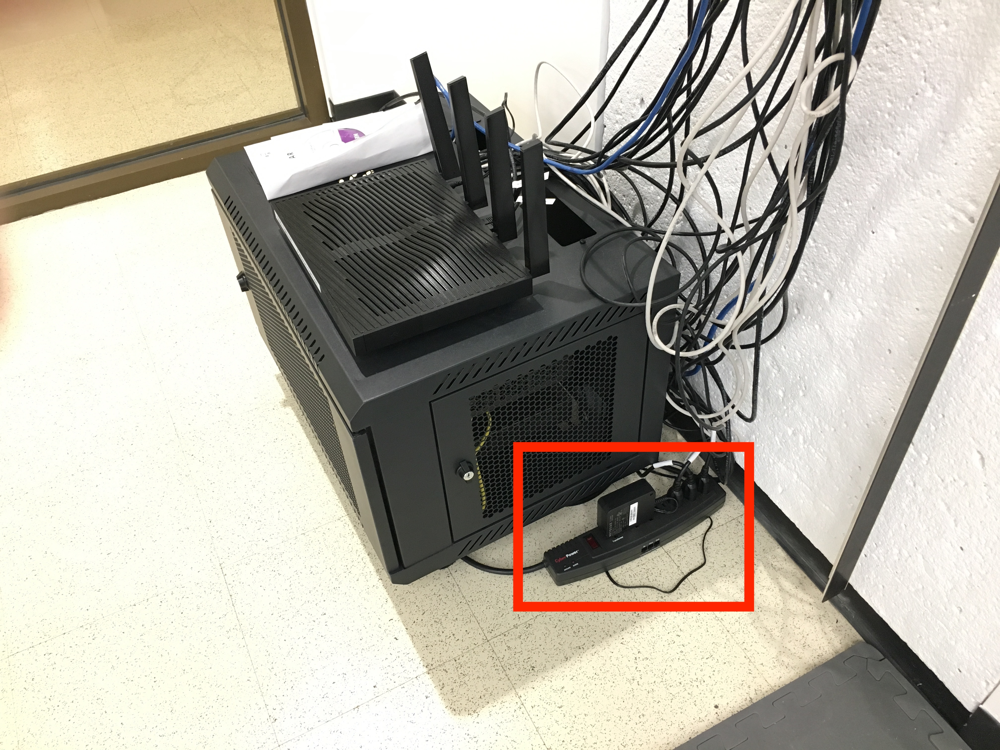

The flight room includes a hidden local network that is used to transmit data between computers. This network purposefully has no Internet connection. Follow these steps to connect your device to this network. 
* Ensure the power strip in the flight room is turned on (the power strip is shown in the image below)
* Connect to the local network
	* SSID and password (WPA2 Personal) are physically labeled on the router

